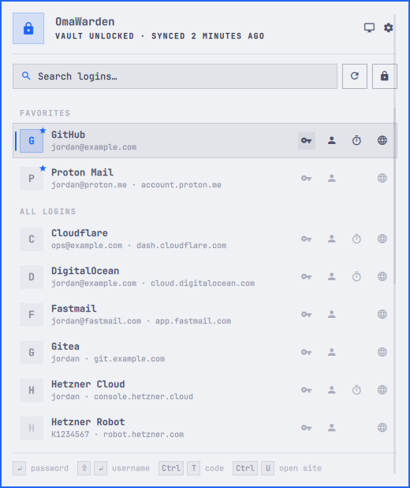
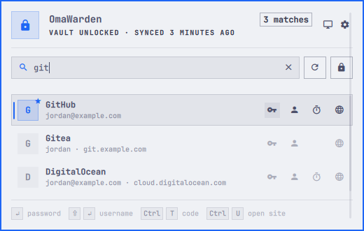
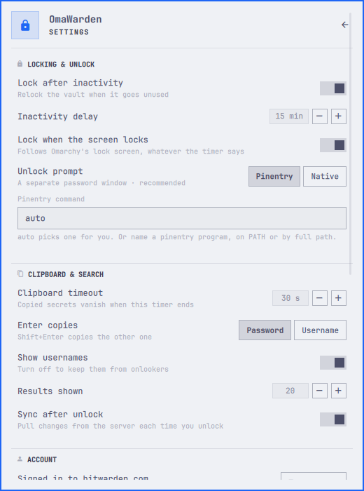
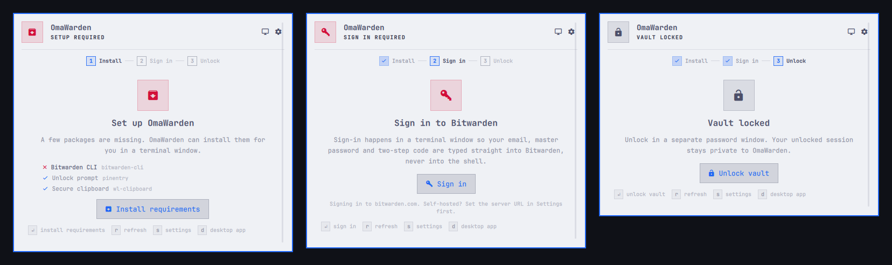
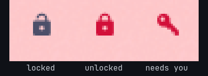

# OmaWarden

**Bitwarden in the Omarchy bar.** Type a few letters, press Enter, and the
password is on your clipboard for thirty seconds — never in Omarchy's
clipboard history, never in the shell.

## Demo


## Screenshots







Before the vault is open — install, sign in, unlock:



The bar icon, locked, unlocked and needing attention:



## Highlights

- **Instant.** Search runs against an in-memory index of names, usernames
  and sites. Results are ranked — `git` finds *GitHub* before
  *DigitalOcean* — and the panel opens on what you used last.
- **Safe.** The shell only ever sees names, usernames and sites. Passwords,
  one-time codes and the session key stay in a small per-user helper and go
  from the Bitwarden CLI straight to a sensitive, self-clearing clipboard.
- **Keyboard first.** `Enter` copies the password, `Shift+Enter` the
  username, `Ctrl+T` the one-time code, `Ctrl+U` opens the site — all
  without leaving the search box.
- **Native.** Built from Omarchy's own components, so it follows your theme
  and locks with your screen.

## Requirements

- Omarchy 4.0 or newer
- `bitwarden-cli`, `wl-clipboard` and `pinentry` — the panel offers to
  install whatever is missing

## Install

```bash
omarchy plugin add https://github.com/salemsayed/omawarden.git --enable
```

A padlock appears in the bar. Click it and follow the three steps:

1. **Install** — one click installs the missing packages in a terminal.
2. **Sign in** — `bw login` runs in a terminal, so your email, master
   password and two-step code go straight to Bitwarden.
3. **Unlock** — enter your master password. Done.

## Use

Open the panel, start typing, press Enter.

Every row has buttons for password, username, one-time code and website.
Buttons for fields a login doesn't have appear faintly on the selected row.

| Key | Action |
| --- | --- |
| `↑` `↓` | Move between results |
| `Enter` | Copy the password (or the username, see Settings) |
| `Shift+Enter` | Copy the other one |
| `Ctrl+C` / `Ctrl+B` | Copy password / username |
| `Ctrl+T` | Copy the one-time code |
| `Ctrl+U` | Open the website |
| `Alt+←` `Alt+→` | Choose the action for the selected row |
| `Ctrl+R` | Sync |
| `Ctrl+L` | Lock |
| `Ctrl+D` | Open the Bitwarden desktop app |
| `Ctrl+,` | Settings |
| `Esc` | Clear the search, then close |

While the vault is locked: `Enter` unlocks, `r` refreshes, `s` opens
settings, `d` opens the desktop app.

Each copy shows a countdown. The clipboard clears after 30 seconds, or the
moment you lock.

**Bar icon:** left-click opens the panel, right-click opens settings,
middle-click syncs.

## Settings

All settings are on the panel's settings page (`Ctrl+,`, or the gear).
They live in Omarchy's `shell.json`, so the same keys work from the
command line:

```bash
omarchy bar set io.github.salemsayed.omawarden autoLockMinutes 10 --json
omarchy bar set io.github.salemsayed.omawarden showUsernames false --json
omarchy bar set io.github.salemsayed.omawarden defaultCopy Username
```

| Key | Default | Meaning |
| --- | --- | --- |
| `inactivityLockEnabled` | `true` | Lock the vault when it goes unused |
| `autoLockMinutes` | `15` | Inactivity delay, 5–240 minutes |
| `lockOnScreenLock` | `true` | Lock the vault with the screen |
| `unlockPrompt` | `Pinentry` | `Pinentry` or `Native` |
| `pinentryCommand` | `auto` | Pinentry program; `auto` picks one |
| `clipboardTimeoutSec` | `30` | Clipboard lifetime, 5–120 seconds |
| `defaultCopy` | `Password` | What Enter copies |
| `showUsernames` | `true` | Show usernames under login names |
| `resultLimit` | `20` | Rows listed at once, 5–50 |
| `syncOnUnlock` | `true` | Sync after each unlock |
| `serverUrl` | *(empty)* | Self-hosted or EU server, applied at sign-in |
| `appDataDir` | *(empty)* | Separate CLI profile for a second account |
| `cliCommand` | `bw` | Bitwarden CLI command |
| `refreshIntervalSec` | `30` | How often the bar re-reads the vault state |

### Unlock prompts

- **Pinentry** (default) — the GnuPG-style prompt runs as a separate
  process; the master password never enters the shell. `auto` uses the
  first of `pinentry-gnome3`, `pinentry-qt`, `pinentry` that is installed.
- **Native** — an Omarchy-themed prompt drawn by the shell, like the lock
  screen. The password is handed to the helper over a private pipe and
  cleared at once. Pick this for looks; Pinentry for isolation.

### Self-hosted, EU and multiple accounts

Set **Server URL** before you sign in; it is applied as part of sign-in.
To change servers later, sign out from the Account section and sign in
again. A second account gets its own **CLI profile folder**.

### Other CLI installs

`cliCommand` accepts a full path or a command with arguments, for example
`flatpak run --command=bw com.bitwarden.desktop`. Nothing goes through a
shell.

## Keybinding

Every panel action is reachable over the shell's IPC:

```lua
-- ~/.config/hypr/bindings.lua
o.bind("SUPER + SHIFT + B", "Bitwarden", "omarchy-shell shell toggle io.github.salemsayed.omawarden")
```

```bash
omarchy-shell io.github.salemsayed.omawarden search git   # open with a query
omarchy-shell io.github.salemsayed.omawarden lock
omarchy-shell io.github.salemsayed.omawarden sync
```

Also `open`, `close`, `toggle`, `settings`, `unlock`, `refresh`, `status`.
There is no `copy` over IPC, on purpose.

## Security

- The panel receives names, usernames, sites and capability flags — never
  passwords, one-time-code seeds, notes or custom fields. Cards, identities
  and notes are not listed.
- The session key lives only in the helper's memory and reaches `bw`
  through its environment, never its arguments.
- The helper listens on a user-only Unix socket in a private runtime
  directory and checks every peer's UID.
- Copies pipe `bw get` straight into `wl-copy --sensitive`; the clipboard
  is cleared at the deadline, on a new copy, and on lock.
- Only `http` and `https` sites from your own vault entries can be opened.
- The index is memory-only and wiped on lock, sign-out and exit.

[SECURITY.md](SECURITY.md) has the threat model and how to report a
vulnerability. Like any desktop integration, OmaWarden cannot protect you
from malware already running as your user.

## Troubleshooting

- **"Setup required" with everything installed** — set the CLI's full path
  under Settings → Advanced.
- **The sign-in terminal says you're already signed in** — close it and
  choose *Unlock vault*.
- **Nothing happens right after unlock** — the first search builds the
  index; large vaults take a second or two.
- **The helper won't start** — `python3 omawarden-agent.py request` prints
  the reason.

## Remove

```bash
omarchy plugin disable io.github.salemsayed.omawarden
omarchy plugin remove io.github.salemsayed.omawarden
```

OmaWarden keeps nothing on disk. Removing it does not sign the Bitwarden
CLI out; run `bw logout` for that.

## Development

```bash
tests/run                    # agent, model and manifest tests
python3 tests/benchmark.py   # 10k-login search benchmark
omarchy plugin validate .
```

See [CONTRIBUTING.md](CONTRIBUTING.md) and
[docs/ARCHITECTURE.md](docs/ARCHITECTURE.md).

## License

[MIT](LICENSE)
